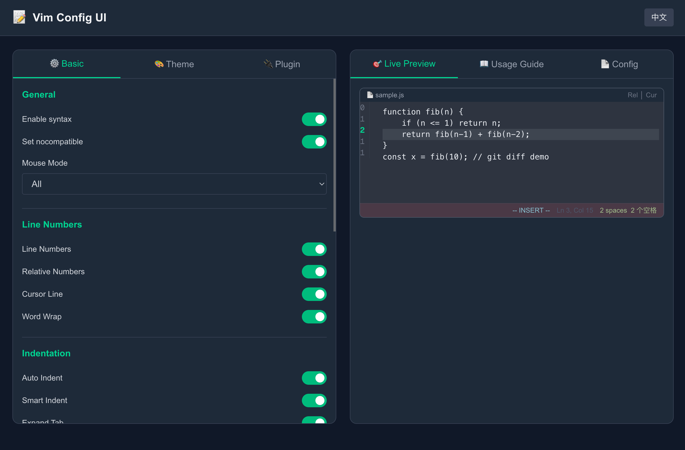
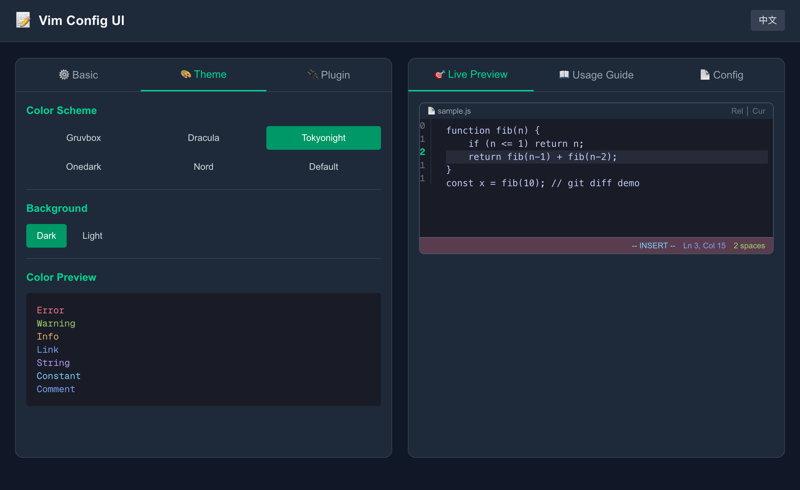
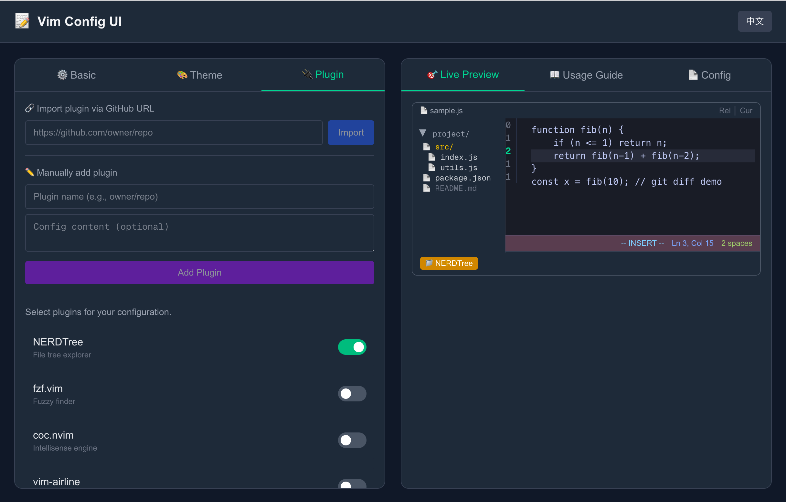
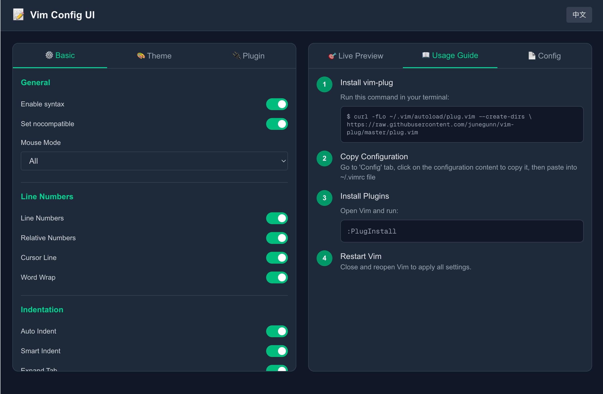
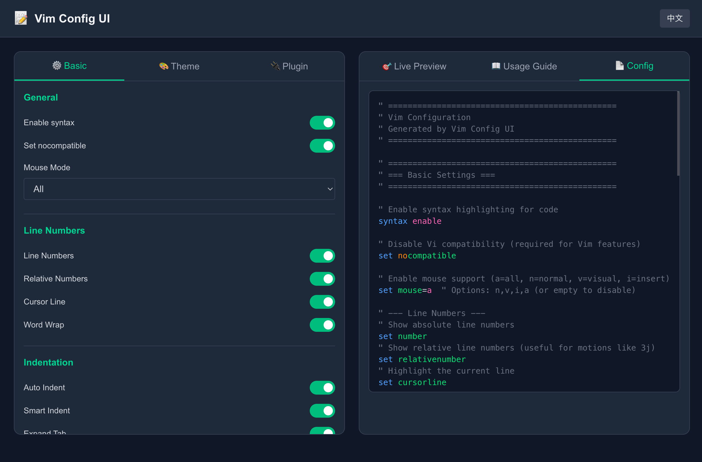

# Vim Config UI

A visual Vim configuration generator that helps you create `.vimrc` files through an intuitive web interface. Supports real-time preview, plugin management, and bilingual interface (English/Chinese).

[中文文档](./README_zh.md)

## Features

- **Basic Settings Configuration**
  - Syntax highlighting, mouse support, line numbers
  - Indentation settings (tabstop, shiftwidth, expandtab)
  - Search options (hlsearch, incsearch, ignorecase, smartcase)
  - UI enhancements (showcmd, showmode, showmatch, wildmenu)
  - File handling (backup, write, swapfile options)

- **Theme Configuration**
  - Built-in color schemes (default, desert, murphy, elflord)
  - Dark/Light background toggle
  - Real-time color preview

- **Plugin Management**
  - Pre-configured popular plugins (NERDTree, vim-airline, vim-surround, etc.)
  - GitHub URL import for custom plugins
  - Manual plugin entry support
  - Automatic vim-plug integration

- **Live Preview**
  - Real-time configuration preview
  - Syntax-highlighted vimrc output
  - One-click copy to clipboard

- **Bilingual Interface**
  - English and Chinese language support
  - Language switch with a single click

## Screenshots

### Basic Settings



### Theme Configuration



### Plugin Management



### Usage Guide



### Configuration Preview



## Installation

```bash
# Clone the repository
git clone https://github.com/shanestevenlei/vim-config-ui.git
cd vim-config-ui

# Install dependencies
npm install

# Run development server
npm run dev
```

Open [http://localhost:3000](http://localhost:3000) in your browser.

## Usage

1. **Configure Settings**: Use the tabs (Basic, Theme, Plugin) to customize your Vim configuration
2. **Preview Changes**: See real-time updates in the Live Preview panel
3. **Copy Configuration**: Click on the configuration content in the Config tab to copy
4. **Apply to Vim**: Paste the configuration into your `~/.vimrc` file

If you've selected plugins or color schemes, install vim-plug first:

```bash
curl -fLo ~/.vim/autoload/plug.vim --create-dirs \
  https://raw.githubusercontent.com/junegunn/vim-plug/master/plug.vim
```

Then open Vim and run `:PlugInstall`.

## Build for Production

```bash
npm run build
npm start
```

## Tech Stack

- [Next.js 16](https://nextjs.org/) - React framework
- [TypeScript](https://www.typescriptlang.org/) - Type safety
- [Tailwind CSS](https://tailwindcss.com/) - Styling
- [Sonner](https://sonner.emilkowal.ski/) - Toast notifications

## License

[MIT](./LICENSE)
