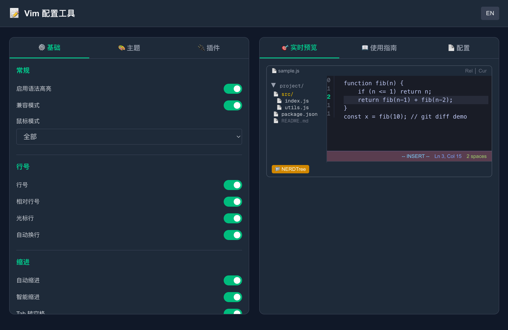
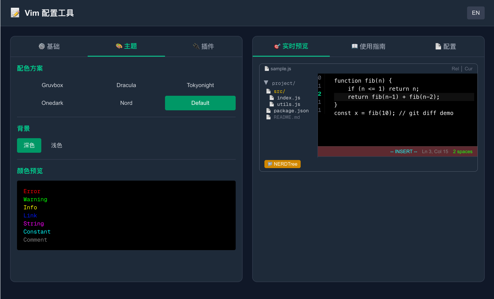
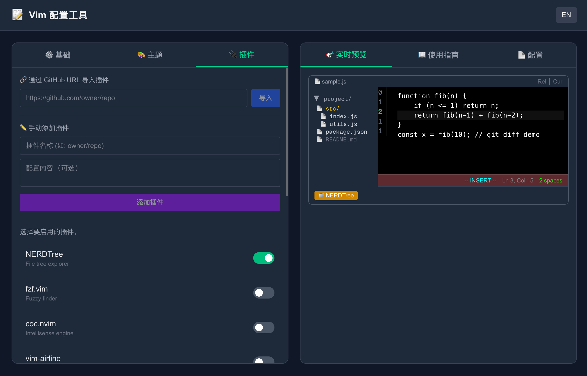
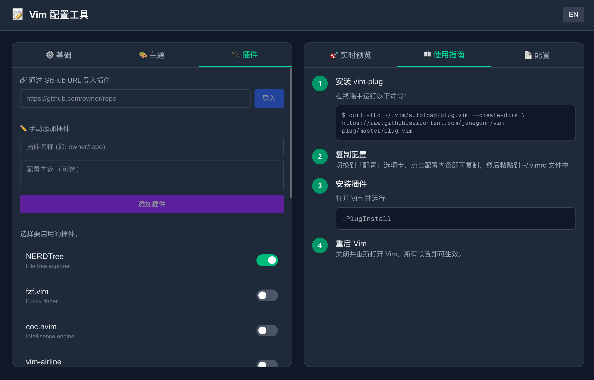
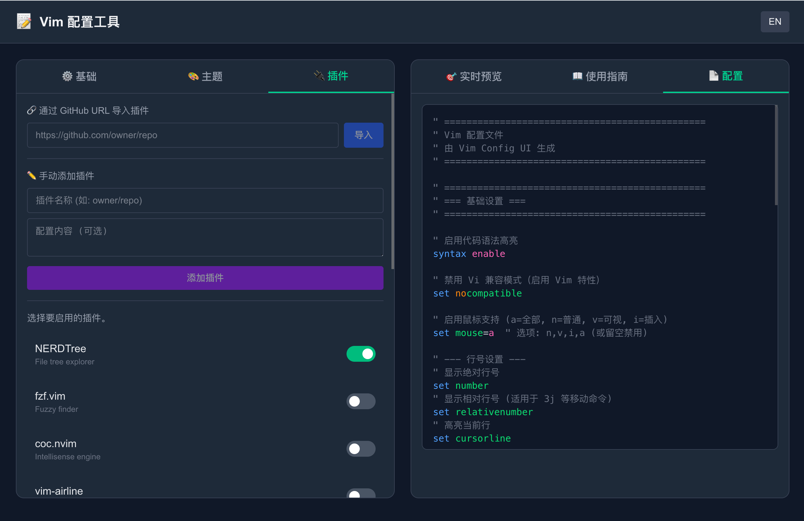

# Vim Config UI

可视化的 Vim 配置生成器，通过直观的 Web 界面帮助您创建 `.vimrc` 文件。支持实时预览、插件管理和双语界面（英文/中文）。

[English](./README.md)

## 功能特性

- **基础设置配置**
  - 语法高亮、鼠标支持、行号显示
  - 缩进设置（tabstop、shiftwidth、expandtab）
  - 搜索选项（hlsearch、incsearch、ignorecase、smartcase）
  - 界面增强（showcmd、showmode、showmatch、wildmenu）
  - 文件处理（备份、写入、交换文件选项）

- **主题配置**
  - 内置配色方案（默认、desert、murphy、elflord 等）
  - 深/浅色背景切换
  - 实时颜色预览

- **插件管理**
  - 预配置热门插件（NERDTree、vim-airline、vim-surround 等）
  - 支持 GitHub URL 导入自定义插件
  - 支持手动输入插件
  - 自动集成 vim-plug

- **实时预览**
  - 配置实时预览
  - 语法高亮的 vimrc 输出
  - 一键复制到剪贴板

- **双语界面**
  - 英文和中文语言支持
  - 单击切换语言

## 界面截图

### 基础设置



### 主题配置



### 插件管理



### 使用指南



### 配置预览



## 安装

```bash
# 克隆仓库
git clone https://github.com/shanestevenlei/vim-config-ui.git
cd vim-config-ui

# 安装依赖
npm install

# 运行开发服务器
npm run dev
```

在浏览器中打开 [http://localhost:3000](http://localhost:3000)。

## 使用方法

1. **配置设置**：使用选项卡（基础、主题、插件）自定义 Vim 配置
2. **预览更改**：在实时预览面板中查看更新
3. **复制配置**：点击配置选项卡中的配置内容进行复制
4. **应用到 Vim**：将配置粘贴到 `~/.vimrc` 文件中

如果您选择了插件或配色方案，需要先安装 vim-plug：

```bash
curl -fLo ~/.vim/autoload/plug.vim --create-dirs \
  https://raw.githubusercontent.com/junegunn/vim-plug/master/plug.vim
```

然后打开 Vim 并运行 `:PlugInstall`。

## 生产环境构建

```bash
npm run build
npm start
```

## 技术栈

- [Next.js 16](https://nextjs.org/) - React 框架
- [TypeScript](https://www.typescriptlang.org/) - 类型安全
- [Tailwind CSS](https://tailwindcss.com/) - 样式
- [Sonner](https://sonner.emilkowal.ski/) - Toast 通知

## 许可证

[MIT](./LICENSE)
